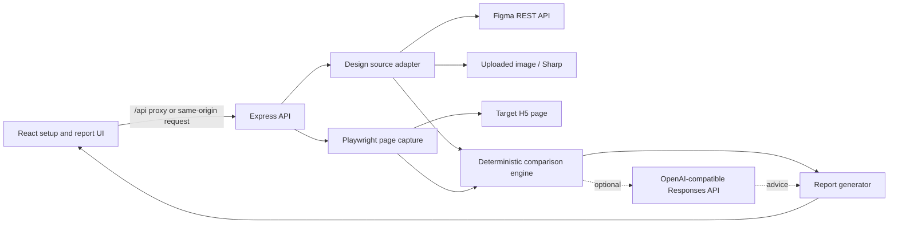

# DiffLab Architecture and Comparison Pipeline

[简体中文](./ARCHITECTURE.md) | [English](./ARCHITECTURE.en.md)

This document describes the runtime components, data flow, comparison algorithm, and known boundaries of the current prototype. The implementation in `src/` and `server/` is authoritative.

## Components



| Layer | Main files | Responsibility |
| --- | --- | --- |
| Frontend | `src/App.tsx`, `src/styles.css` | Collect inputs, edit rules, call APIs, display and export reports |
| API orchestration | `server/index.ts` | Routes, upload limits, and design/capture/comparison/AI/report orchestration |
| Design input | `server/design.ts` | Parse a Figma Frame or uploaded image into a common design source |
| Page capture | `server/capture.ts` | Fix the browser environment, wait for stability, capture a screenshot, and extract DOM/static findings |
| Rule parsing | `server/default-rules.ts` | YAML parsing, defaults, range clamping, and rule severities |
| Comparison engine | `server/compare.ts` | Pixel diff, node matching, property comparison, and issue ordering |
| AI advice | `server/ai.ts` | List models, call the Responses API, and parse structured advice |
| Reporting | `server/report.ts` | Compute final status and generate UI data, Markdown, and standalone HTML |
| Shared models | `src/types.ts` | Configuration, element, issue, and report types shared by client and server |

## Lifecycle of a real comparison

1. The frontend submits a Figma URL or image, H5 URL, YAML, and optional AI settings to `POST /api/compare`.
2. The server parses the YAML. Missing values use defaults; out-of-range numeric values are clamped.
3. The design source is normalized:
   - Figma mode reads the target node, renders a PNG at scale 1, and flattens up to 1,200 comparable nodes;
   - Image mode normalizes the input to PNG, retains only its dimensions, and produces no design elements.
4. If the rules specify an explicit viewport, the design image and element coordinates are scaled independently on the X and Y axes.
5. Playwright creates a DPR 1, light-mode, reduced-motion browser context, loads the H5 page, and waits for fonts, images, an optional selector, and layout stability.
6. It captures the viewport, extracts up to 1,500 visible DOM elements, and audits broken images, horizontal overflow, and clipped text.
7. The comparison engine computes pixel similarity, a diff image, and diff regions, then performs element matching and property checks.
8. If AI is enabled, the server sends the two PNGs and up to 35 deterministic findings to the selected model. Failure only adds a diagnostic and cannot alter the rule result.
9. The report generator derives `passed` or `failed` solely from the number of `error` findings, then returns embedded base64 images, issues, effective rules, diagnostics, and export content.

## Reproducible capture environment

Every capture fixes the following conditions:

- The viewport comes from the design PNG dimensions or an explicit YAML override;
- `deviceScaleFactor: 1`;
- `colorScheme: light`;
- `reducedMotion: reduce`;
- CSS disables animation, transitions, smooth scrolling, and the caret;
- Only the current viewport is captured, not the full page;
- The launcher tries local Google Chrome first and falls back to Playwright Chromium.

After `domcontentloaded`, the capture waits for fonts and images. Layout stabilization compares up to five DOM geometry snapshots with `settle_ms` between attempts. If the page never stabilizes, the run still completes, but diagnostics warn about dynamic noise.

Valid selectors in `ignore` receive `visibility: hidden` before the screenshot and are excluded from DOM extraction and static audits. An invalid selector does not fail the run; it is recorded in diagnostics.

## Pixel comparison

The reference image and actual capture are resized to the same integer viewport, converted to RGBA, and passed to `pixelmatch`:

- `pixel_threshold` controls how sensitive an individual pixel is to color difference;
- Antialiasing differences are excluded;
- `similarity = 1 - changedPixels / totalPixels`;
- Unchanged pixels are transparent in the diff image;
- Changed pixels are assigned to a 24–64 px grid, and eight-directionally adjacent cells are merged. Regions with at least 18 changed pixels become fixed `warning` findings; only the top eight by changed-pixel count are kept.

`visual_similarity_min` and `rules.visual_similarity` together determine whether overall similarity triggers a gate finding.

## Element matching

For Figma input, one-to-one DOM matching proceeds in this order:

1. **Exact id:** `data-figma-id` matches the Figma node id, with confidence 1; hyphens and colons are normalized.
2. **Equal text:** normalized text matches after whitespace and case normalization, then center distance, size, and type refine confidence.
3. **Geometry heuristic:** center distance, size similarity, and type compatibility produce a score; only scores at or above `match_confidence_min` are accepted.

Matched elements can be checked for position, size, text, font size/weight/line height, color, border radius/width, and opacity. When confidence is below `high_confidence_min`, findings originally configured as `error` are downgraded to `pending`; `warning`, `info`, and `pending` remain unchanged.

At most 40 unmatched design nodes are reported. Text nodes, nodes named like button/CTA/logo/input, and ids in `critical_figma_nodes` use the configured `missing_element` severity; other nodes are fixed to `pending`. When structured design elements exist, up to 20 meaningful unmatched DOM elements are reported as extras.

## Reporting and gating

Issues are sorted as `error → warning → pending → info`. The final rule is intentionally simple:

```text
errors > 0  => failed
errors == 0 => passed
```

A report contains:

- Result id, timestamp, duration, and source labels;
- Error/warning/pending counts, similarity, and matched-element count;
- Reference, actual, and diff images;
- Each issue's rule, expected and actual values, suggestion, selector/node id, confidence, and region;
- Parsed effective rules and runtime diagnostics;
- Optional AI summary;
- Ready-to-save Markdown and standalone HTML.

The frontend removes embedded images, HTML, and Markdown when exporting JSON to keep the file smaller.

## Prototype boundaries

- No login-state orchestration, interaction scripts, multiple pages, viewport matrix, or historical baseline management;
- Image references support only pixel comparison and H5 static audits, not element-property checks;
- Figma flattening is heuristic and does not fully represent Auto Layout, variables, component semantics, or every paint/effect;
- The capture environment does not inject business fonts, cookies, or request mocks;
- The H5 URL is checked only for an HTTP/HTTPS scheme and does not isolate private-network addresses;
- The service has no authentication or rate limiting, listens only on the loopback interface, and is not a production deployment design.
