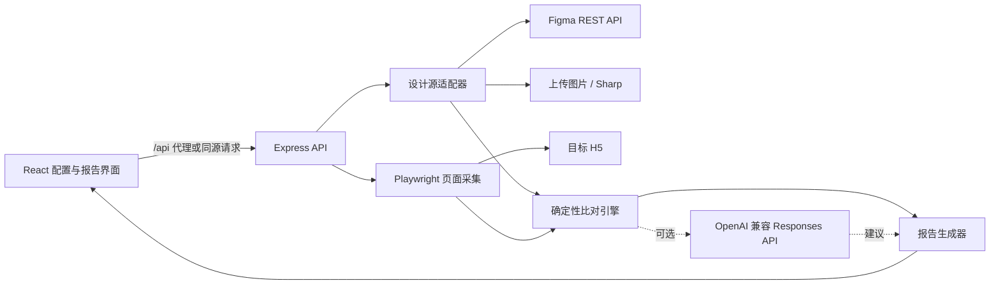

# DiffLab 架构与比对流程

[简体中文](./ARCHITECTURE.md) | [English](./ARCHITECTURE.en.md)

本文描述当前原型的运行组件、数据流、比对算法和已知边界。实现以 `src/` 与 `server/` 中的代码为准。

## 组件概览



| 层 | 主要文件 | 职责 |
| --- | --- | --- |
| 前端 | `src/App.tsx`、`src/styles.css` | 收集输入、编辑规则、调用 API、展示与导出报告 |
| API 编排 | `server/index.ts` | 路由、上传限制、设计/采集/比对/AI/报告串联 |
| 设计输入 | `server/design.ts` | 解析 Figma Frame 或上传图片，生成统一设计源 |
| 页面采集 | `server/capture.ts` | 固定浏览器环境、等待页面稳定、截图、提取 DOM 与静态问题 |
| 规则解析 | `server/default-rules.ts` | YAML 解析、默认值、范围钳制、规则严重级别 |
| 比对引擎 | `server/compare.ts` | 像素差异、节点匹配、属性比较、问题排序 |
| AI 建议 | `server/ai.ts` | 获取模型列表、调用 Responses API、解析结构化建议 |
| 报告 | `server/report.ts` | 计算最终状态，生成页面数据、Markdown 和独立 HTML |
| 共享模型 | `src/types.ts` | 前后端共用的配置、元素、问题和报告类型 |

## 一次真实比对的生命周期

1. 前端把 Figma 链接或图片、H5 URL、YAML 和可选 AI 设置提交到 `POST /api/compare`。
2. 服务端解析 YAML。缺失值使用默认配置，数值超出范围时会被钳制。
3. 设计源被标准化：
   - Figma 模式读取目标 node、以 scale 1 渲染 PNG，并展平最多 1200 个可比较节点；
   - 图片模式把输入规范化为 PNG，只保留图片尺寸，不产生设计元素。
4. 若规则指定固定 viewport，设计图片及元素坐标按 X/Y 比例缩放到该视口。
5. Playwright 创建 DPR 1、浅色、减少动画的浏览器上下文，加载 H5 并等待字体、图片、可选选择器和布局稳定。
6. 采集首屏截图、最多 1500 个可见 DOM 元素，以及破图、横向溢出和裁切文本审计结果。
7. 比对引擎计算像素相似度、差异热图和差异区域，再执行节点匹配与元素属性规则。
8. 如果启用 AI，服务把两张 PNG 和最多 35 条规则问题发送给指定模型。失败只写入诊断信息，不改变规则结果。
9. 报告生成器只根据 `error` 数量确定 `passed` 或 `failed`，并返回内嵌 base64 图片、问题、规则、诊断和导出内容。

## 可复现的采集环境

每次采集固定以下条件：

- viewport 来自设计图尺寸，或 YAML 中的显式覆盖；
- `deviceScaleFactor: 1`；
- `colorScheme: light`；
- `reducedMotion: reduce`；
- 页面动画、过渡、平滑滚动和光标被 CSS 禁用；
- 只截取当前视口，不截取完整长页面；
- 优先启动本机 Chrome，失败后回退到 Playwright Chromium。

页面在 `domcontentloaded` 后继续等待字体与图片。布局稳定检测最多比较 5 次 DOM 几何快照，每次间隔 `settle_ms`；如果始终变化，仍会生成报告，但诊断中会提示动态噪声。

`ignore` 中的有效选择器在截图前设置为 `visibility: hidden`，并从 DOM 提取与静态审计中排除。无效选择器不会中断任务，只记录诊断。

## 像素比对

参考图和实际截图都被缩放到同一整数 viewport，转成 RGBA 后交给 `pixelmatch`：

- `pixel_threshold` 控制单像素颜色差被判为变化的灵敏度；
- 抗锯齿差异不计入变化；
- `similarity = 1 - changedPixels / totalPixels`；
- 差异图使用透明背景标记未变化像素；
- 变化像素被放入 24–64 px 的网格，再把八方向相邻网格聚合为区域；变化像素至少 18 个的区域会成为固定 `warning`，最多保留变化像素数最高的 8 个区域。

整体相似度是否触发门禁由 `visual_similarity_min` 与 `rules.visual_similarity` 共同决定。

## 元素匹配

Figma 输入按以下顺序一对一匹配 DOM：

1. **精确 id**：`data-figma-id` 与 Figma node id 匹配，置信度为 1；连字符与冒号会归一化。
2. **相同文本**：规范化空白和大小写后文本相同，再结合中心点距离、尺寸和类型计算置信度。
3. **几何启发式**：按中心点距离、尺寸相似度和类型兼容性评分，只接受不低于 `match_confidence_min` 的结果。

匹配后的元素可检查位置、尺寸、文本、字号/字重/行高、颜色、圆角/边框/透明度。置信度低于 `high_confidence_min` 时，这些检查原本配置为 `error` 的问题会降级为 `pending`；`warning`、`info` 和 `pending` 保持原级别。

未匹配的设计节点最多报告 40 个。文本节点、名称像 button/CTA/logo/input 的节点以及 `critical_figma_nodes` 中的节点使用 `missing_element` 的配置级别；其余节点固定为 `pending`。有结构化设计元素时，最多报告 20 个有意义的额外 DOM 元素。

## 报告和门禁

问题按 `error → warning → pending → info` 排序。最终规则很简单：

```text
errors > 0  => failed
errors == 0 => passed
```

报告中包含：

- 结果 id、时间、耗时和来源；
- 错误/警告/待确认数量、相似度、匹配元素数；
- 参考图、实际图、差异图；
- 每条问题的规则、设计值、实际值、建议、选择器/node id、置信度和区域；
- 实际生效的解析后规则与运行诊断；
- 可选 AI 摘要；
- 可直接保存的 Markdown 和独立 HTML。

前端导出的 JSON 会移除内嵌图片、HTML 和 Markdown，以减小文件体积。

## 原型边界

- 没有登录态编排、交互脚本、多页面、多视口矩阵或历史基线管理；
- 图片基准只能做像素与 H5 静态审计，不能做元素属性比较；
- Figma 节点展平是启发式实现，不完整表达 Auto Layout、变量、组件语义或所有 paint/effect；
- 截图环境不注入业务字体、Cookie 或请求 mock；
- H5 URL 只校验 HTTP/HTTPS 协议，不隔离内网地址；
- 服务无认证与限流，仅监听本机回环地址，不是生产部署方案。
